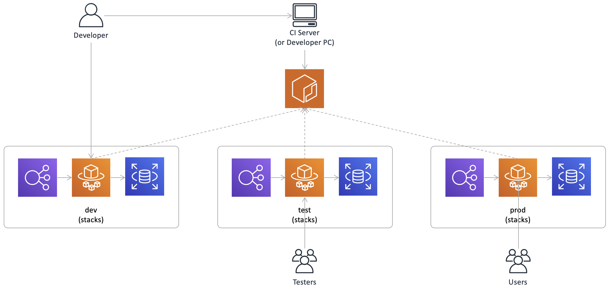
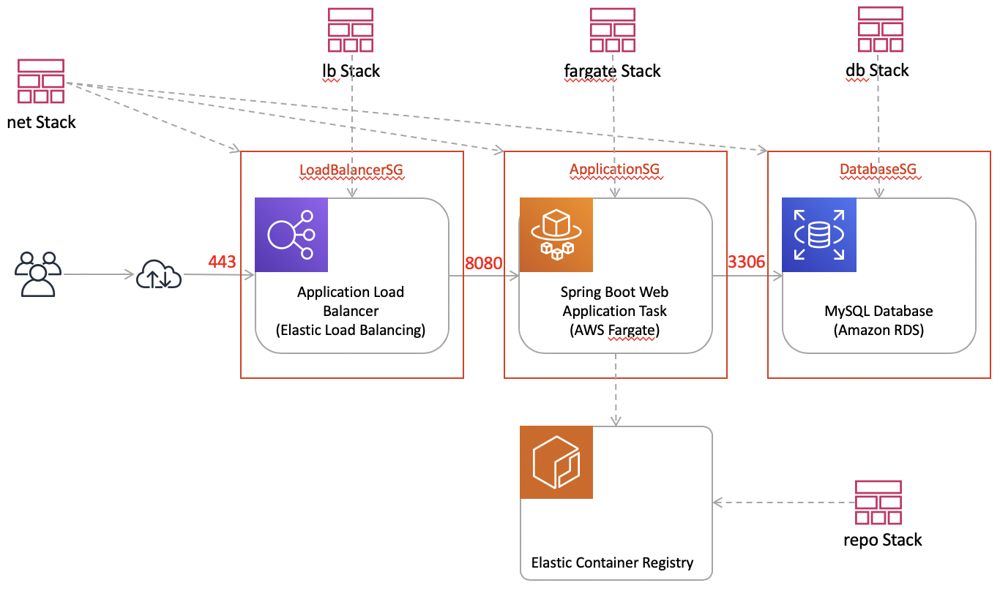
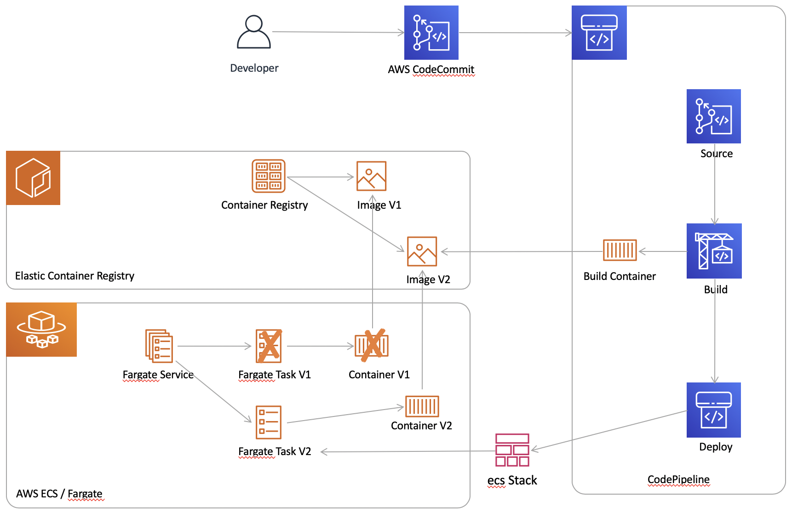

# Let's play with AWS Fargate (and a Spring Boot test workload) 

Vertical architecture slice:
- Application Load Balancer (TLS-termination)
- Containerized Java Spring Boot web application (with JDBC persistence) running as a AWS Fargate service
- Amazon RDS for MySQL and Flyway for database migration

## All automated - from zero to cloud in 13'

Pre-Conditions:
- AWS CLI installed & configured (sufficient IAM permissions, default region configured)
- Default VPC is present in the default AWS region
- Docker is installed and running
- Linux-like environment or macOS (bash, curl, sed, ...) 
- openssl installed (used for password generation)
- General advice: read - and understand - all shell scripts and CloudFormation YAML templates before executing them

### Automated AWS dev env setup (CloudFormation stacks for ECR, ALB, Fargate Service & RDS)

Disclaimer:
- Not production ready yet (e.g. automation scripts w/o error handling)
- Costs (until teardown): approx. 75 USD/month

Steps:

    ./setup.sh dev
    ./curl-loop.sh dev

### Deploy new application version to dev env (mvn build, docker push & Fargate deploy)

Steps:

    ./update.sh dev

### Automated AWS dev env teardown (delete all CloudFormation stacks)

Disclaimer:
- Not production ready yet (e.g. automation scripts w/o error handling)
- All data lost (docker images, logs, database content)!!!

Steps:

    ./teardown.sh dev

## Let's go to production

### AWS setup (dev, test & prod)

Disclaimer:
- Not production ready yet (e.g. automation scripts w/o error handling)
- Costs (until teardown): approx. 3*75 USD/month

Steps:

	./setup.sh dev
	./setup-n.sh test dev
	./setup-n.sh prod test

### Deployment to dev (mvn build, docker push & Fargate deploy) 

Steps:
	
	./update.sh dev

### Staging from dev to test

Steps:

	./update-n.sh test dev

### Staging from test to prod

Steps:

	./update-n.sh prod test

### AWS teardown (dev, test & prod)

Disclaimer:
- Not production ready yet (e.g. automation scripts w/o error handling)
- All data lost (docker images, logs, database content)!!!

Steps:

	./teardown-n.sh prod
	./teardown-n.sh test
	./teardown.sh dev

## Behind the scenes (CloudFormation and AWS CLI)

The AWS resources will be created in multiple CloudFormation stacks which rely on each other (via exported outputs and Fn::ImportValue).

### Security Groups

 
With properly configured VPC Security Groups, these requirements will be met:
- End user web browsers can only communicate with the application load balancer (HTTPS, port 443 - currently also 80 for testing w/o ACM certificates)
- Only the application load balancer can communicate with the Spring Boot web application (HTTP, port 8080)
- Only the Spring Boot web application can communicate with the database (MySQL, port 3306)

CloudFormation YAML template (some details omitted):

	...
	Resources:
	  ApplicationSG:
	    Type: "AWS::EC2::SecurityGroup"
	    Properties:
	      GroupDescription: HTTP 8080
	      SecurityGroupIngress:
	        - FromPort: 8080
	          IpProtocol: tcp
	          SourceSecurityGroupId: !GetAtt LoadBalancerSG.GroupId
	          ToPort: 8080
	      VpcId: !Ref VPC
	
	  DatabaseSG:
	    Type: "AWS::EC2::SecurityGroup"
	    Properties:
	      GroupDescription: MySQL
	      SecurityGroupIngress:
	        - FromPort: 3306
	          IpProtocol: tcp
	          SourceSecurityGroupId: !GetAtt ApplicationSG.GroupId
	          ToPort: 3306
	      VpcId: !Ref VPC
	
	  LoadBalancerSG:
	    Type: "AWS::EC2::SecurityGroup"
	    Properties:
	      GroupDescription: HTTP and HTTPS
	      SecurityGroupIngress:
	        - CidrIp: "0.0.0.0/0"
	          FromPort: 443
	          IpProtocol: tcp
	          ToPort: 443
	        - CidrIp: "0.0.0.0/0"
	          FromPort: 80
	          IpProtocol: tcp
	          ToPort: 80
	      VpcId: !Ref VPC
	  ...	      

Create the CloudFormation stack via AWS CLI:

    DEFAULT_VPC_ID=$(aws ec2 describe-vpcs --query 'Vpcs[?IsDefault==`true`].VpcId' --output text)
    SUBNET_IDS=$(aws ec2 describe-subnets --query "Subnets[?VpcId==\`$DEFAULT_VPC_ID\`].SubnetId" --output text | sed 's/[[:space:]]/,/g')

    aws cloudformation create-stack \
        --stack-name samplewebworkload-net-dev \
        --template-body file://cloudformation/securitygroups.yaml \
        --parameters ParameterKey=Subnets,ParameterValue=\"$SUBNET_IDS\" \
                     ParameterKey=VPC,ParameterValue=$DEFAULT_VPC_ID

### Application Load Balancer

 
A properly configured Application Load Balancer meets the following requirements:
- TLSListeer: terminates HTTPS traffic and is associated with an (already manually created) AWS Certificate Manager TLS certificate
- TargetGroup: forwards all traffic to the Spring Boot Fargate service via HTTP
- A Route53 CNAME record can refer the CNAME of the Application Load Balancer (can be configured manually in a subsequent step)

CloudFormation YAML template (some details omitted):

	...
	Resources:
	  LoadBalancer:
	    Type: "AWS::ElasticLoadBalancingV2::LoadBalancer"
	    Properties:
	      LoadBalancerAttributes:
	        - Key: idle_timeout.timeout_seconds
	          Value: 60
	      Scheme: internet-facing
	      SecurityGroups:
	        - "Fn::ImportValue": !Sub ${NetworkStack}-LoadBalancerSG
	      Subnets: !Split
	        - ","
	        - "Fn::ImportValue": !Sub ${NetworkStack}-Subnets
	
	  TLSListener:
	    Type: "AWS::ElasticLoadBalancingV2::Listener"
	    Properties:
	      Certificates:
	        - CertificateArn: !Ref CertificateArn
	      DefaultActions:
	        - TargetGroupArn: !Ref TargetGroup
	          Type: forward
	      LoadBalancerArn: !Ref LoadBalancer
	      Port: 443
	      Protocol: HTTPS
	
	  TargetGroup:
	    Type: "AWS::ElasticLoadBalancingV2::TargetGroup"
	    Properties:
	      HealthCheckIntervalSeconds: 30
	      HealthCheckPath: /
	      HealthCheckTimeoutSeconds: 5
	      HealthyThresholdCount: 2
	      Port: 8080
	      Protocol: HTTP
	      TargetGroupAttributes:
	        - Key: deregistration_delay.timeout_seconds
	          Value: 60
	      TargetType: ip
	      UnhealthyThresholdCount: 4
	      VpcId: !ImportValue
	        "Fn::Sub": ${NetworkStack}-VPC
	  ...

Create the CloudFormation stack via AWS CLI:

    SSL_CERT_ARN="arn:aws:acm:eu-west-1:20...:certificate/73..." #your ACM cert ARN

    aws cloudformation create-stack \
        --stack-name samplewebworkload-lb-dev \
        --template-body file://cloudformation/applicationloadbalancer.yaml \
        --parameters ParameterKey=CertificateArn,ParameterValue="$SSL_CERT_ARN" \
                     ParameterKey=NetworkStack,ParameterValue=samplewebworkload-net-dev

### RDS MySQL Database

 

CloudFormation YAML template (some details omitted):

	...
	Resources:
	  DB:
	    Type: "AWS::RDS::DBInstance"
	    DeletionPolicy: Delete
	    Properties:
	      AllocatedStorage: "5"
	      DBInstanceClass: db.t3.micro
	      DBName: db
	      DBSubnetGroupName: !Ref DBSubnetGroup
	      Engine: MySQL
	      MasterUserPassword: !Ref MasterUserPassword
	      MasterUsername: masteruser
	      VPCSecurityGroups:
	        - "Fn::ImportValue": !Sub ${NetworkStack}-DatabaseSG
	
	  DBSubnetGroup:
	    Type: "AWS::RDS::DBSubnetGroup"
	    Properties:
	      DBSubnetGroupDescription: db subnet group
	      SubnetIds: !Split
	        - ","
	        - "Fn::ImportValue": !Sub ${NetworkStack}-Subnets
	  ...	        

First, create a new random password (via openssl, for now) and also store the password in SSM Parameter Store as a secure string (via AWS CLI):

    PASS=$(openssl rand -hex 20)
    DB_PASSWORD_PARAM_NAME="dev.db.rand.pass"
    aws ssm put-parameter --overwrite --name $DB_PASSWORD_PARAM_NAME --type SecureString --value "$PASS"

Create the CloudFormation stack via AWS CLI:

    aws cloudformation create-stack \
        --stack-name samplewebworkload-db-dev \
        --template-body file://cloudformation/database.yaml \
        --parameters ParameterKey=MasterUserPassword,ParameterValue=$PASS \
                     ParameterKey=NetworkStack,ParameterValue=samplewebworkload-net-dev

### Private Docker Registry

 
For application deployment, a private docker registry is required. Elastic Container Registry (ECR) will do the job.

CloudFormation YAML template (some details omitted):

	...
	Resources:
	  DockerRepo:
	    Type: "AWS::ECR::Repository"
	    Properties:
	      RepositoryName: !Ref "AWS::StackName"
	  ...

Create the CloudFormation stack via AWS CLI:

    aws cloudformation create-stack \
        --stack-name samplewebworkload-repo-dev \
        --template-body file://cloudformation/ecr.yaml

Now, let's build and push the docker image:

    ./mvnw clean install dockerfile:build
    
    LOCAL_TAG=chtzuehlke/sample-web-workload:latest
    REMOTE_TAG=$(./get-stack-output.sh samplewebworkload-repo-dev DockerRepoUrl):version1
    
    docker tag $LOCAL_TAG $REMOTE_TAG
    
    $(aws ecr get-login --no-include-email)    
    docker push $REMOTE_TAG

### Spring Boot Application

It's time to setup our Spring Boot Fargate Service:
- One FargateService with one task (TaskDefinition) with one container (ContainerDefinitions) with the Spring Boot application
- The docker image is already waiting in ECR for deployment
- MySQL host and port configuration will be provided via environment variables
- As the MySQL password is stored in AWS Systems Manager Parameter Store as secure string, we will pass the parameter name to the application via an environment variable (SSM Parameter Store secrets are unfortunately not yet supported in CloudFormation container definitions)
- The application will leverage the AWS SDK for Java to lookup the password in SSM Parameter Store. Required IAM permissions are configured in the TaskRole
- The application will log into a CloudWatch logs group. Required IAM permissions are configured in the ECSExecutionRole, amongst others

CloudFormation YAML template (some details omitted):

	...
	Resources:
	  ECSExecutionRole:
	    Type: "AWS::IAM::Role"
	    Properties:
	      AssumeRolePolicyDocument:
	        Version: "2012-10-17"
	        Statement:
	          - Effect: Allow
	            Principal:
	              Service:
	                - ecs-tasks.amazonaws.com
	            Action:
	              - "sts:AssumeRole"
	      ManagedPolicyArns:
	        - "arn:aws:iam::aws:policy/service-role/AmazonECSTaskExecutionRolePolicy"
	      MaxSessionDuration: 3600
	      Path: /service-role/
	
	  FargateCluster:
	    Type: "AWS::ECS::Cluster"
	
	  FargateService:
	    Type: "AWS::ECS::Service"
	    Properties:
	      Cluster: !Ref FargateCluster
	      DeploymentConfiguration:
	        MaximumPercent: 200
	        MinimumHealthyPercent: 100
	      DesiredCount: 1
	      LaunchType: FARGATE
	      LoadBalancers:
	        - ContainerName: !Ref "AWS::StackName"
	          ContainerPort: 8080
	          TargetGroupArn: !ImportValue
	            "Fn::Sub": ${LoadBalancerStack}-TargetGroup
	      NetworkConfiguration:
	        AwsvpcConfiguration:
	          AssignPublicIp: ENABLED
	          SecurityGroups:
	            - "Fn::ImportValue": !Sub ${NetworkStack}-ApplicationSG
	          Subnets: !Split
	            - ","
	            - "Fn::ImportValue": !Sub ${NetworkStack}-Subnets
	      PlatformVersion: LATEST
	      SchedulingStrategy: REPLICA
	      TaskDefinition: !Ref TaskDefinition
	
	  TaskDefinition:
	    Type: "AWS::ECS::TaskDefinition"
	    Properties:
	      ContainerDefinitions:
	        - Cpu: "1024"
	          Environment:
	            - Name: DBPort
	              Value: !ImportValue
	                "Fn::Sub": ${DatabaseStack}-DBPort
	            - Name: DBAddress
	              Value: !ImportValue
	                "Fn::Sub": ${DatabaseStack}-DBAddress
	            - Name: DBPassSSMName
	              Value: !Ref DBPassSSMName
	          Essential: true
	          Image: !Ref "DockerImage"
	          LogConfiguration:
	            LogDriver: awslogs
	            Options:
	              awslogs-group: !Ref TaskLogGroup
	              awslogs-region: !Ref "AWS::Region"
	              awslogs-stream-prefix: ecs
	          Memory: "2048"
	          MemoryReservation: "2048"
	          Name: !Ref "AWS::StackName"
	          PortMappings:
	            - ContainerPort: 8080
	              Protocol: tcp
	      Cpu: "1024"
	      ExecutionRoleArn: !GetAtt ECSExecutionRole.Arn
	      Family: !Ref "AWS::StackName"
	      Memory: "2048"
	      NetworkMode: awsvpc
	      RequiresCompatibilities:
	        - FARGATE
	      TaskRoleArn: !GetAtt TaskRole.Arn
	
	  TaskLogGroup:
	    Type: "AWS::Logs::LogGroup"
	    Properties:
	      LogGroupName: !Join
	        - ""
	        - - /ecs/
	          - Ref: "AWS::StackName"
	      RetentionInDays: 7
	
	  TaskRole:
	    Type: "AWS::IAM::Role"
	    Properties:
	      AssumeRolePolicyDocument:
	        Version: "2012-10-17"
	        Statement:
	          - Effect: Allow
	            Principal:
	              Service:
	                - ecs-tasks.amazonaws.com
	            Action:
	              - "sts:AssumeRole"
	      MaxSessionDuration: 3600
	      Path: /service-role/
	      Policies:
	        - PolicyName: !Sub "TaskRole-${AWS::StackName}"
	          PolicyDocument:
	            Version: "2012-10-17"
	            Statement:
	              - Effect: Allow
	                Action:
	                  - "ssm:GetParameter"
	                Resource:
	                  - "Fn::Sub": "arn:aws:ssm:${AWS::Region}:${AWS::AccountId}:parameter/${DBPassSSMName}"
	  ...	                  

Create the CloudFormation stack via AWS CLI:

    REMOTE_TAG=$(./get-stack-output.sh samplewebworkload-repo-dev DockerRepoUrl):version1
        
    DB_PASSWORD_PARAM_NAME="dev.db.rand.pass"
    
    aws cloudformation create-stack \
        --capabilities CAPABILITY_IAM \
        --stack-name samplewebworkload-fargatew-dev \
        --template-body file://cloudformation/fargate.yaml \
        --parameters ParameterKey=NetworkStack,ParameterValue=samplewebworkload-net-dev \
                     ParameterKey=LoadBalancerStack,ParameterValue=samplewebworkload-lb-dev \
                     ParameterKey=DatabaseStack,ParameterValue=samplewebworkload-db-dev \
                     ParameterKey=DBPassSSMName,ParameterValue=$DB_PASSWORD_PARAM_NAME \
                     ParameterKey=DockerImage,ParameterValue=$REMOTE_TAG

Later, a new application version (pushed docker image) can be deployed as follows:

    REMOTE_TAG=$(./get-stack-output.sh samplewebworkload-repo-dev DockerRepoUrl):version2
        
    aws cloudformation update-stack \
        --capabilities CAPABILITY_IAM \
        --stack-name samplewebworkload-fargatew-dev \
        --use-previous-template
        --parameters ParameterKey=NetworkStack,UsePreviousValue=true \
                     ParameterKey=LoadBalancerStack,UsePreviousValue=true \
                     ParameterKey=DatabaseStack,UsePreviousValue=true \
                     ParameterKey=DBPassSSMName,UsePreviousValue=true \
                     ParameterKey=DockerImage,ParameterValue=$REMOTE_TAG

Keep in mind: as old and new versions will have DB access at the same time (during deployment), DB changes must be backwards-compatible and applications must be forwards- and backwards-compatible (e.g. add columns, not delete or rename columns).

Test it:

    curl http://$(./get-stack-output.sh samplewebworkload-lb-dev LoadBalancer)/
        
    curl --insecure https://$(./get-stack-output.sh samplewebworkload-lb-dev LoadBalancer)/ #access via ACM cert hostname does not need --insecure

## AWS Infrastructure - dev environment in one diagram

# [Bonus] Let's build a simplistic CI(/CD) pipeline (still in alpha)

## Create a CodeCommit git repository

Pre-Conditions:
- Create a default SSH key pair and associate the public key with your IAM user
- Configuration in ~/.ssh/config (see https://docs.aws.amazon.com/codecommit/latest/userguide/setting-up-ssh-unixes.html)
- Fargate stack up and running (e.g. ./setup.sh executed)

Steps:

	./create-stack-codecommit.sh dev

## Create a build- and deploy pipeline (CodePipeline & CodeBuild)

Steps:

	./create-stack-pipeline.sh dev

Trigger build and deploy:

	git remote add aws $(./get-stack-output.sh helloworld-dev-git CodeCommitRepositoryCloneURL)
	git push aws

## Teardown

	./teardown-stack-pipeline.sh dev

	git remote rm aws
	./teardown-stack-codecommit.sh dev

## Change Log

- Version 1.0: initial
- Version 1.1: yaml formatted (with cfn-format-osx-amd64), script cleanups, typos fixed, scripts in README.md tested
- Version 1.2: scripts refactored (multi env support), CloudFormation templates moved to cloudformation folder
- Version 1.3: scripts refactored and staging introduced (e.g. dev to test to prod)
- Version 1.4: build pipeline (currently with "barn door IAM policies" in certain roles)
- Version 1.5: resolved build pipeline teardown issues (CF role deleted too early)
